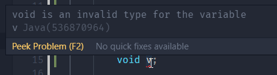

# JAVA PER IDIOTI

Per prima cosa im java per iniziare il programma dobbiamo dichiarare le classi del programma
Esempio:
```java
class Esempio {                         //Qui indichiamo il nome della classe, esso è estremamente importante e fondamentale per il funzionamento

//questa parte è dove iseriremo le variabili (oggetti o primitive o wrapper) e le funzioni della classe (metodi)

}
```
Ogni classe di java deve avere la funzione main
```java
public static void main(String[] args) {                            //questo metodo è il più importante ed è necessaria la sua presenza in ogni classe

//QUi è dove inseriamo le funzioni e le variabili che useremo nel metodo

}              
```
"pubblic": serve per indicare che questo metodo è visibile da tutti senza esclusioni
"static":
"void": il tipo di dato che il nostro metodo da in ritorno e può essere utilizzato solo per ritorni
una cosa come ad esempio: "void v;" non è possibile da fare

```java
public static void log(String str) {
  System.out.println(str);
}
```
Non posso dichiarare più volte la stessa variabile con lo stesso nome perchè è come se dicessi al compilatore di creare la stessa variabile con due valori diversi e manderebbe in conflitto
Esempio:
```java
String s1 = "asasasas";
String s1 = "afdvazbz";            // errore
```
```java
String s1 = "asasasasa";
s1 = "schifo"               // giusto
```
i wrapper e i primitivi sono compatibili tra di loro
Esempio:
```java
public static Integer add(int a, int b) {
        return a + b;
    }
```
Creando classsi
```java
class Cane {
    String name;

    // Constructor
    public Cane(String name){
        name = name;                  
    }
```


Es 1 zanca:
// TODO costructor that accepts name and age with alive defaulting to true

    /*public String isAlive(String name, Integer age, Boolean alive) {
        this.name = name;
        this.age = age;
        alive = true;

        if (alive = true)  {

            System.out.println("My name is "+name);                         
            System.out.println("i'm "+age);
            System.out.println("and i'm alive");
        }
        else {
            System.out.println("My name is "+name);
            System.out.println("and i'm dead");
        }
        
        return name;
    }*/

    


[Back to index page](readme.md)

[Back Home](../../readme.md)
